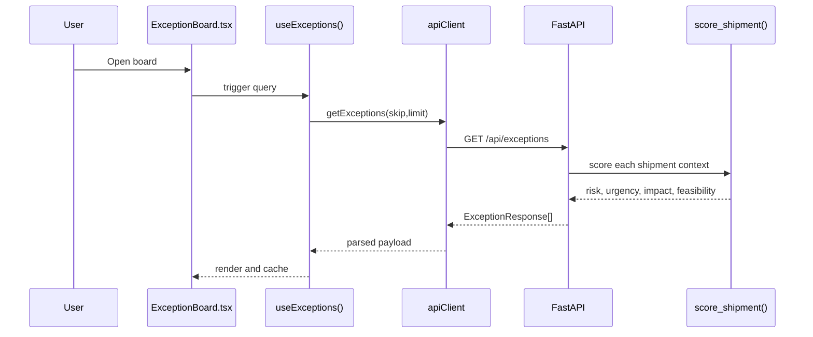
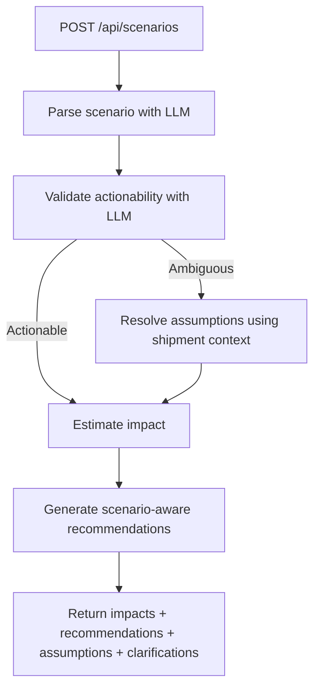
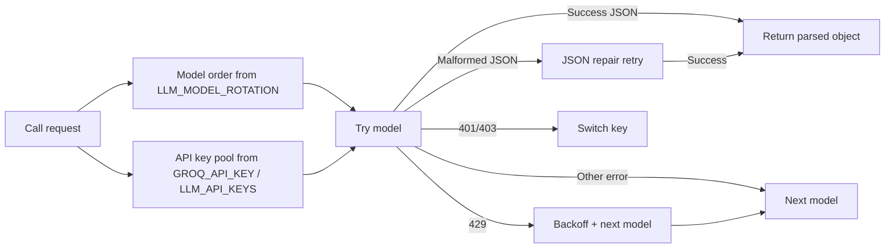
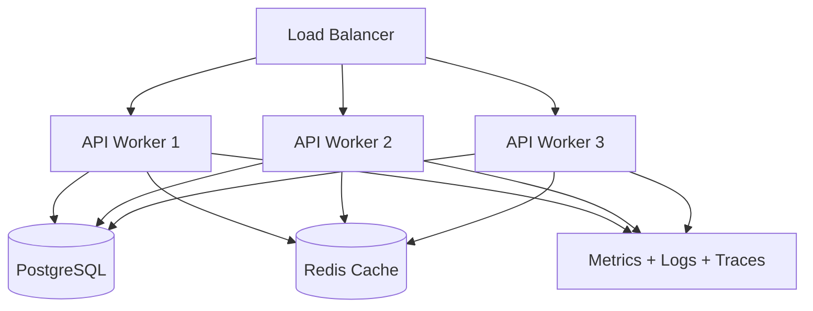

# Control Tower AI - System Architecture (Current Version)

This document describes the present architecture and runtime behavior of Control Tower AI based on the current codebase.

## 1) System Overview

Control Tower AI is a logistics decision platform with:
- React frontend for live operational monitoring.
- FastAPI backend exposing orchestration endpoints.
- Python decision engine for risk scoring, candidate generation, constraint validation, and audit logging.
- LLM-assisted reasoning for recommendation ranking and scenario interpretation.

Core objective:
- Convert multi-source shipment signals into operationally safe, explainable actions.

---

## 2) High-Level Architecture

```mermaid
flowchart TB
    subgraph FE[Frontend: React + TypeScript]
        P1[Home / KPI / Action Center]
        P2[Exception Board]
        P3[Shipment Decision Modal]
        P4[Scenario Analysis]
        RQ[React Query + API Client]
        P1 --> RQ
        P2 --> RQ
        P3 --> RQ
        P4 --> RQ
    end

    subgraph API[Backend API: FastAPI]
        E1[/api/exceptions]
        E2[/api/recommendations/{shipment_id}]
        E3[/api/scenarios]
        E4[/api/kpi-summary]
        E5[/api/tasks]
        E6[/api/llm-status]
    end

    subgraph Engine[Decision Engine Modules]
        M1[initial.py]
        M2[candidate_engine.py]
        M3[decision_scorer.py]
        M4[post_validator.py]
        M5[scenario_engine.py]
        M6[graph_engine.py]
        M7[audit_logger.py]
        M8[llm_router.py]
    end

    subgraph Data[Data Sources]
        D1[tos_terminal.csv]
        D2[tms_transport.csv]
        D3[wms_warehouse.csv]
        D4[customs_compliance.csv]
        D5[erp_finance.csv]
        D6[logistics_visibility.csv]
        D7[iot_telemetry.csv]
    end

    RQ <--> API
    API --> Engine
    Engine --> Data
    Engine <--> M8
```

---

## 3) Data Flow by Capability

### 3.1 Exception Board



### 3.2 Recommendations

```mermaid
flowchart TD
    A[GET /api/recommendations/{shipment}] --> B[Build shipment context]
    B --> C[Generate candidate actions]
    C --> D[Rank candidates]
    D --> E[LLM prompt with operational snapshot + constraints]
    E --> F[LLM router call]
    F --> G[Output contract validation]
    G --> H[Hard constraint enforcement]
    H --> I[White-box explanation formatting]
    I --> J[Top recommendations response]
```

### 3.3 Scenario Analysis (Current Behavior)



Current scenario behavior:
- Ambiguous scenarios do not hard-stop immediately.
- System attempts assumption resolution using shipment context.
- Response includes assumptions used, clarification questions, and computed outcome.

---

## 4) Backend Module Responsibilities

- api_server.py
  - API endpoints and orchestration.
  - Loads env and datasets at startup.
  - Coordinates recommendation and scenario pipelines.

- initial.py
  - Shipment scoring and recommendation prompt construction.
  - Builds operational snapshot and constraints for LLM ranking.

- candidate_engine.py
  - Candidate action generation from graph routes and local mitigation options.
  - Adds evidence, feasibility flags, blocked reasons, owner, due-by.

- decision_scorer.py
  - Weighted scoring and ranking for candidate actions.

- post_validator.py
  - Output shape checks.
  - Enforces hard constraints.
  - Adjusts selected action when selected option violates constraints and valid alternative exists.

- scenario_engine.py
  - Parse and semantic validation.
  - Assumption-based scenario resolution for ambiguous input.
  - Impact estimation.

- llm_router.py
  - Model/key configuration and calls.
  - JSON response parsing and repair retry.
  - Rate-limit backoff handling.
  - TLS context support via env.

- graph_engine.py
  - Route graph construction and path/lane operations.

- audit_logger.py
  - Decision trace event creation and persistence.

---

## 5) LLM Runtime Architecture



TLS controls:
- LLM_CA_BUNDLE
- SSL_CERT_FILE
- REQUESTS_CA_BUNDLE
- LLM_TLS_INSECURE (non-production bypass)

---

## 6) Decision Safety and Explainability

Safety layers:
1. Candidate generation includes feasibility and blocked reasons.
2. LLM must choose from provided action IDs only.
3. Post-validation enforces customs/dispatch and other hard constraints.
4. Response generation preserves owner/due-by accountability fields.

Explainability layers:
- Situation
- Evidence
- Constraint check
- Action items
- Why this over alternatives

---

## 7) Frontend Runtime Model

React Query model:
- Query caching with per-endpoint stale times.
- Retry tuned to reduce unnecessary duplicate LLM load on recommendation calls.
- Error details surfaced from backend `detail` payloads.

UI behavior:
- Loading, error, retry, and empty states implemented in recommendation and scenario views.
- Scenario page displays backend clarification and validation details.

---

## 8) Current Constraints and Known Operational Patterns

- Backend currently uses CSV datasets as source of truth.
- API is single-process in local development.
- LLM calls are dependency-critical for recommendation and scenario interpretation.
- Reliability depends on model availability, key health, network/TLS trust chain, and prompt size.

---

## 9) Deployment Evolution Path (Recommended)



Production priorities:
- Replace CSV runtime dependency with database-backed storage.
- Add authn/authz and role controls.
- Centralize secrets and key rotation.
- Add background workers for heavy scenario/recommendation jobs.

---

## 10) Endpoint Summary

Implemented endpoints:
- GET /health
- GET /api/health
- GET /api/llm-status
- GET /api/exceptions
- GET /api/exceptions/{shipment_id}
- GET /api/recommendations/{shipment_id}
- GET /api/kpi-summary
- POST /api/scenarios
- GET /api/shipments
- GET /api/tasks
- POST /api/tasks
- PUT /api/tasks/{task_id}

---

## 11) Document Scope

This file describes current architecture and behavior, not historical design assumptions.
For user onboarding and setup, see README.md.
