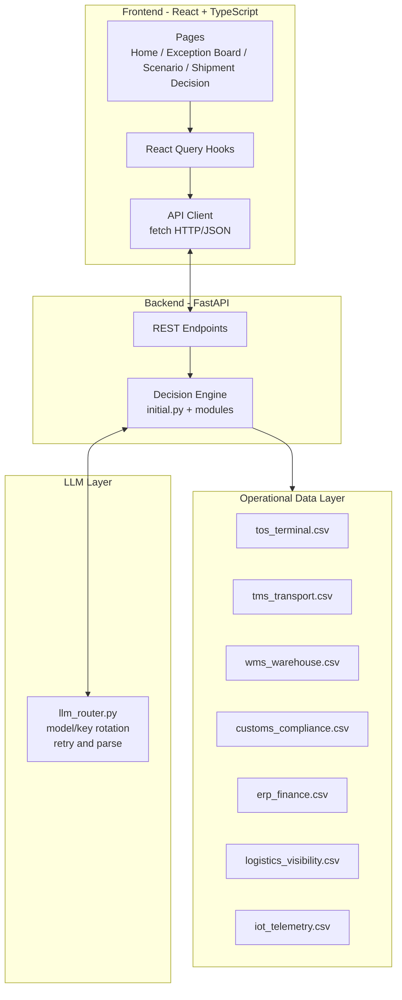
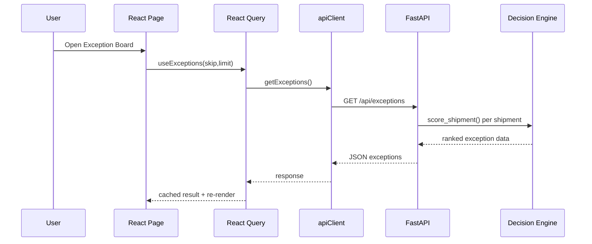
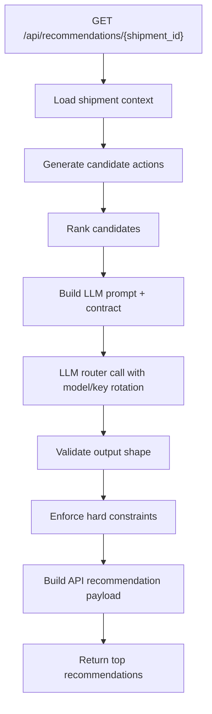
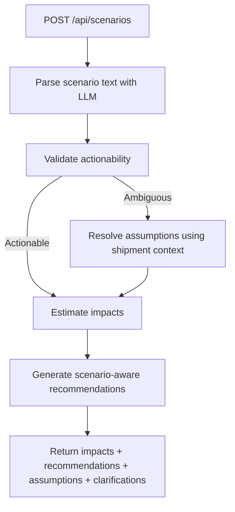
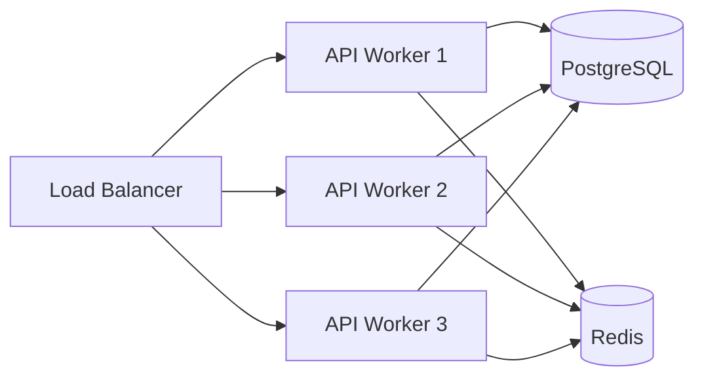

# Control Tower AI

Control Tower AI is an AI-assisted logistics decision intelligence platform for monitoring shipment risk, triaging exceptions, running what-if scenario analysis, and generating explainable operational recommendations.

It combines:
- A React frontend for live operations visibility.
- A FastAPI backend for orchestration and APIs.
- A Python decision engine for risk scoring, candidate action generation, constraint validation, and audit logging.
- LLM-assisted reasoning for ranked recommendations and scenario understanding.

---

Please check - `video.txt` (https://drive.google.com/file/d/167D9O3Q8hLPIH5m0h33LeJ_x_tUfcakG/view?usp=sharing)

## 1) What This Application Is

This application is a control tower for shipment operations, designed for teams who need to answer questions like:
- Which shipments are at highest risk right now?
- What action should we take first, and why?
- If disruption worsens, what happens to SLA and cost?

The system consumes operational and financial signals from multiple data sources and produces:
- A risk-ranked exception board.
- Shipment-level AI recommendations with white-box reasoning.
- Scenario simulation outputs with impact estimates and clarifying assumptions.

---

## 2) End Users

Primary end users:
- Control Tower Manager: Prioritizes exceptions and approves interventions.
- Terminal Planner: Executes slot, yard, and terminal-side actions.
- Customs and Compliance Officer: Resolves customs/documentation constraints.
- Transport Planner: Handles routing and carrier-level interventions.
- Operations Analyst: Monitors KPIs, trends, and action outcomes.

What each user gets:
- Context-aware recommendations tied to shipment evidence.
- Action owner and due-by fields for operational accountability.
- Confidence and impact details to support decision speed.

---

## 3) Product Capabilities

### 3.1 Exception Intelligence
- Scores shipments across urgency, impact, and feasibility.
- Sorts and displays high-risk shipments first.
- Surfaces issue drivers from terminal, transport, customs, finance, visibility, and telemetry signals.

### 3.2 Recommendation Engine
- Generates candidate actions from graph-based route options and local mitigation options.
- Uses LLM to rank and explain actions in strict output contract.
- Enforces hard constraints post-LLM to block unsafe/invalid selected actions.
- Returns action-level explanation, data sources, owner, and due-by.

### 3.3 Scenario Analysis
- Parses free-text scenario requests.
- Validates actionability with LLM.
- If ambiguous, resolves assumptions from shipment context and continues simulation.
- Returns impacts (`slaDeltaPct`, `demurrageDeltaUsd`), recommendations, assumptions used, and clarification questions.

### 3.4 Task Operations
- Lists and updates tasks.
- Supports creation/upsert and status updates.

---

## 4) High-Level Architecture



---

## 5) Request/Response Workflow

### 5.1 Exception Board Flow



### 5.2 Recommendation Flow



### 5.3 Scenario Analysis Flow



---

## 6) Backend Module Responsibilities

- `backend/api_server.py`
	- FastAPI app and endpoint definitions.
	- Startup loading of datasets and graph initialization.
	- Exception, recommendation, KPI, scenario, shipment, and task endpoints.

- `backend/initial.py`
	- Core scoring and recommendation orchestration.
	- Prompt construction for recommendation reasoning.
	- Environment loading and strict variable handling.

- `backend/candidate_engine.py`
	- Candidate action generation from route graph and local mitigation logic.
	- Includes action metadata, feasibility, and evidence.

- `backend/decision_scorer.py`
	- Candidate ranking and scoring components.

- `backend/post_validator.py`
	- Output shape enforcement.
	- Hard constraints and post-selection safety checks.

- `backend/scenario_engine.py`
	- Scenario parse, validate, resolve ambiguity with assumptions, and impact estimation.

- `backend/llm_router.py`
	- LLM call execution, model rotation, key rotation, and resilience behavior.

- `backend/graph_engine.py`
	- Route topology, lane capacity checks, and route planning primitives.

- `backend/audit_logger.py`
	- Writes auditable decision traces to JSONL logs.

---

## 7) API Surface

Core endpoints:
- `GET /health`
- `GET /api/health`
- `GET /api/llm-status`
- `GET /api/exceptions`
- `GET /api/exceptions/{shipment_id}`
- `GET /api/recommendations/{shipment_id}`
- `GET /api/kpi-summary`
- `POST /api/scenarios`
- `GET /api/shipments`
- `GET /api/tasks`
- `POST /api/tasks`
- `PUT /api/tasks/{task_id}`

Scenario response includes:
- `slaDeltaPct`
- `demurrageDeltaUsd`
- `recommendation`
- `assumptionsUsed`
- `clarificationQuestions`
- `validation`
- `analysisNotes`

---

## 8) Data Model and Sources

Data files in `backend/datasets/`:
- `tos_terminal.csv`: terminal operations and congestion indicators.
- `tms_transport.csv`: transport delays, carrier reliability, and gate queue.
- `wms_warehouse.csv`: dispatch readiness and warehouse bottlenecks.
- `customs_compliance.csv`: clearance status, document quality, compliance flags.
- `erp_finance.csv`: SLA breach probability and demurrage risk.
- `logistics_visibility.csv`: journey and transshipment continuity.
- `iot_telemetry.csv`: handling and condition-related exceptions.

The backend builds shipment-centric context by indexing latest rows per shipment across all sources.

---

## 9) Scoring and Prioritization Logic

Shipment risk combines:
- Urgency score: severity and count of active alerts.
- Impact score: SLA risk, demurrage pressure, and free-time sensitivity.
- Feasibility score: penalties for sanctions/customs/vehicle/slot constraints.

Combined risk is computed as weighted blend:
- urgency 45%
- impact 35%
- inverse feasibility 20%

This produces exception board ordering from highest to lowest risk.

---

## 10) Recommendation Design Principles

- Constraint-first reasoning.
- No invented action IDs.
- Candidate actions only from engine-generated set.
- Explainability required for each action.
- Owner and due-by always provided.
- Post-validation prevents invalid selected actions.

White-box rationale sections:
- Situation
- Evidence
- Constraint check
- Action items
- Why this over alternatives

---

## 11) Scenario Design Principles

- Free text supported.
- Actionability validated before execution.
- Ambiguous requests do not dead-end.
- If ambiguity exists, assumptions are generated from context and returned explicitly.
- Clarification questions are still returned for operator follow-up.

This gives users a usable answer immediately while preserving transparency.

---

## 12) Frontend Architecture

Frontend stack:
- React + TypeScript
- Vite
- React Query for server-state caching
- API client + transformers layer

Key frontend areas:
- `src/pages/` for major views.
- `src/components/` for operational UI modules.
- `src/api/client.ts` for HTTP transport and error handling.
- `src/api/queries.ts` for query/mutation hooks.
- `src/utils/transformers.ts` for DTO-to-domain mapping.

Caching model:
- endpoint-specific stale times
- periodic refetch for live boards
- mutation invalidation for task updates

---

## 13) Runtime and Deployment Model

Current development model:
- Frontend on `http://localhost:8080`
- Backend on `http://localhost:5000`
- CSV-backed data and single-process API runtime

Future production model:
- Multi-worker API deployment
- database-backed persistence
- distributed cache
- stronger authn/authz and policy controls
- observability and trace correlation



---

## 14) Local Development Setup

Prerequisites:
- Node.js 18+
- npm 9+
- Python 3.10+
- Internet access for package installation and LLM calls

### 14.1 Clone and Open

1. Clone the repository.
2. Open the project root in your editor.
3. Confirm root contains `package.json` and `backend/` folder.

### 14.2 Backend Setup (Python)

#### Windows (PowerShell)

1. Create virtual environment:

```powershell
cd backend
py -m venv .venv
```

2. Activate virtual environment:

```powershell
.\.venv\Scripts\Activate.ps1
```

3. Install dependencies:

```powershell
pip install --upgrade pip
pip install -r requirements.txt
```

4. Configure environment file:
- Ensure `backend/.env` contains at least:
	- `GROQ_API_KEY=...`
	- `LLM_MODEL_ROTATION=...`
	- `STRICT_DATA_QUALITY=true`

5. Start backend API:

```powershell
python run_api.py
```

Backend will run at `http://localhost:5000`.

#### macOS / Linux

1. Create virtual environment:

```bash
cd backend
python3 -m venv .venv
```

2. Activate virtual environment:

```bash
source .venv/bin/activate
```

3. Install dependencies:

```bash
pip install --upgrade pip
pip install -r requirements.txt
```

4. Configure `backend/.env` with required variables.

5. Start backend API:

```bash
python run_api.py
```

### 14.3 Frontend Setup (React)

From project root:

```bash
npm install
npm run dev
```

Frontend runs at `http://localhost:8080` (default Vite local URL).

### 14.4 Verify Everything Is Running

Health checks:
- Open `http://localhost:5000/api/health`
- Open `http://localhost:5000/api/llm-status`

Expected:
- `api/health` should report datasets loaded.
- `api/llm-status` should report model list and credential status.

### 14.5 Run a Quick Scenario Test

PowerShell example:

```powershell
$body = @{ shipmentId = 'SHP-008'; scenarioText = 'Port congestion worsens by 20% and customs processing slows by 4 hours.' } | ConvertTo-Json
Invoke-RestMethod -Uri 'http://localhost:5000/api/scenarios' -Method POST -ContentType 'application/json' -Body $body | ConvertTo-Json -Depth 8
```

Expected:
- Response includes impact values and recommendation list.
- If ambiguous, response should include `assumptionsUsed` and `clarificationQuestions` while still returning a computed outcome.

### 14.6 Common Startup Issues

1. `ModuleNotFoundError` or import errors
- Virtual environment not activated.
- Re-activate `.venv` and run `pip install -r requirements.txt` again.

2. `503 Missing LLM credentials`
- `GROQ_API_KEY` missing or invalid in `backend/.env`.

3. TLS certificate errors (`CERTIFICATE_VERIFY_FAILED`)
- Configure one of:
	- `LLM_CA_BUNDLE=<path_to_ca_bundle.pem>`
	- `SSL_CERT_FILE=<path_to_ca_bundle.pem>`
	- `REQUESTS_CA_BUNDLE=<path_to_ca_bundle.pem>`
- Temporary non-production bypass:
	- `LLM_TLS_INSECURE=true`

4. Port already in use
- Stop old processes using port 5000 or 8080.

### 14.7 Development Workflow

1. Start backend first.
2. Start frontend second.
3. Open app in browser.
4. Verify exception board and recommendation modal fetch live data.
5. Use scenario page for what-if runs and inspect assumptions/clarification outputs.

---

## 15) Configuration

Common backend environment variables:
- `GROQ_API_KEY`
- `LLM_API_KEYS` (optional, comma-separated)
- `LLM_MODEL_ROTATION` (comma-separated model order)
- `STRICT_DATA_QUALITY` (`true/false`)
- `LLM_CA_BUNDLE` (optional CA path for TLS trust)
- `SSL_CERT_FILE` (optional CA path)
- `REQUESTS_CA_BUNDLE` (optional CA path)
- `LLM_TLS_INSECURE` (temporary non-production TLS bypass)

LLM behavior:
- model rotation for resilience
- key rotation when multiple keys exist
- strict output parsing and contract enforcement

---

## 16) Reliability and Failure Handling

Designed failure modes:
- Missing datasets: API returns `503` until initialized.
- Invalid scenario text: API returns descriptive `400`.
- Ambiguous scenario intent: resolved with assumptions and clarifications.
- LLM failures: retry across configured models/keys and structured diagnostics.

Operational debugging endpoint:
- `GET /api/llm-status` for credentials/model visibility.

---

## 17) Security and Compliance Notes

Current state (development-oriented):
- local development CORS settings
- API-key based model access

Recommended production controls:
- secret vault integration
- key rotation policy
- strict TLS trust-chain management
- role-based access control
- request-level audit trace IDs

---

## 18) Decision Auditability

Each recommendation run can be logged with:
- selected action
- ranked alternatives
- score components
- constraint checks
- recommendation rationale
- source metadata

This enables post-incident analysis and governance reviews.

---

## 19) Repository Structure

Top-level:
- `src/` frontend app
- `backend/` decision and API services
- `public/` static assets
- `ARCHITECTURE.md` detailed system-flow reference

Backend highlights:
- `api_server.py`
- `initial.py`
- `candidate_engine.py`
- `decision_scorer.py`
- `post_validator.py`
- `scenario_engine.py`
- `llm_router.py`

---

## 20) What Makes This App Different

- Multi-source logistics reasoning in one control surface.
- Action recommendations with explicit white-box justifications.
- Scenario analysis that can still produce output under ambiguity.
- Safety checks after AI ranking to enforce operational constraints.
- Architecture that is straightforward for teams to extend.

---

## 21) Future Enhancements

- Role-specific recommendation views.
- Historical outcome feedback loops for model/policy tuning.
- Policy engine for region- and carrier-specific constraints.
- Multi-tenant data partitioning.
- SLA/cost outcome forecasting dashboards.

---

## 22) Quick Glossary

- Exception: Shipment state requiring intervention.
- Candidate Action: Engine-generated feasible intervention option.
- Feasibility: Constraint-based viability score/flag for an action.
- White-box reasoning: Transparent, evidence-linked explanation of recommendation.
- Scenario assumption: Explicit inferred value used to execute an ambiguous request.

---

## 23) Reference

For deeper architecture narrative and ASCII flow reference, see:
- `ARCHITECTURE.md`
